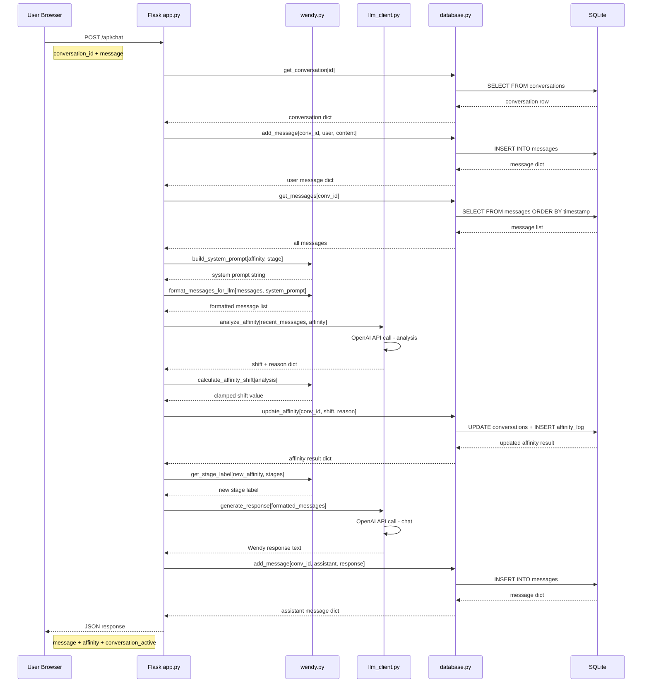
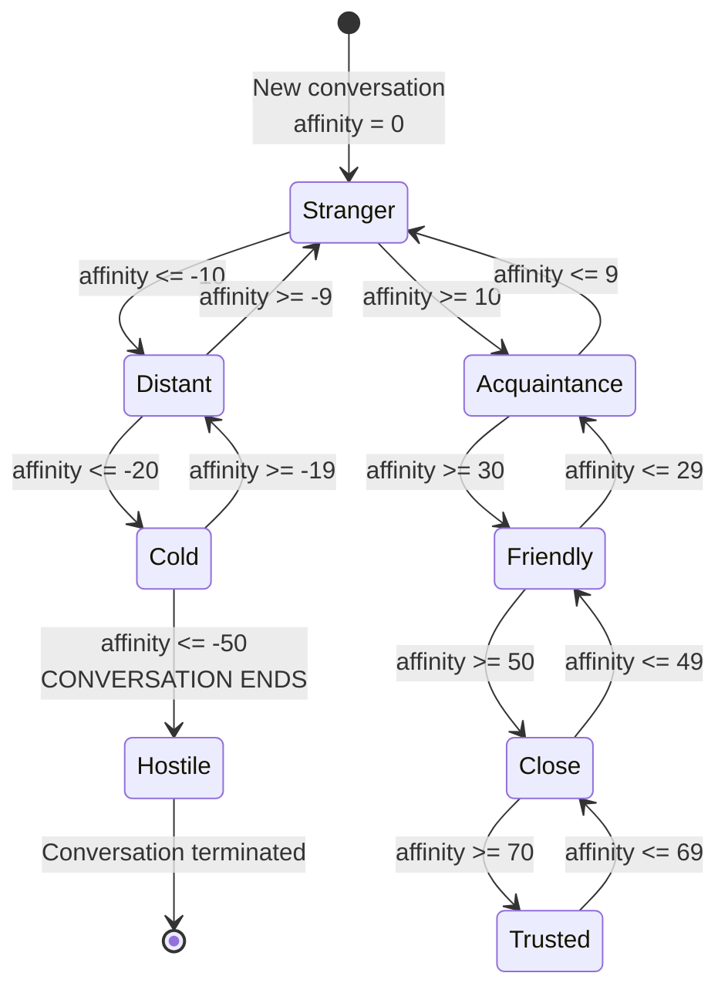

# Wendy NPC Conversation Demo — Architecture Document

> **Status:** Draft  
> **Last Updated:** 2026-04-05  
> **Project Root:** `c:/Wendy`

---

## Table of Contents

1. [Project Overview](#1-project-overview)
2. [File Structure](#2-file-structure)
3. [Database Schema](#3-database-schema)
4. [API Contracts](#4-api-contracts)
5. [Component Interfaces](#5-component-interfaces)
6. [Configuration](#6-configuration)
7. [Affinity Stage Definitions](#7-affinity-stage-definitions)
8. [LLM Integration Design](#8-llm-integration-design)
9. [Data Flow Diagrams](#9-data-flow-diagrams)

---

## 1. Project Overview

Wendy is a standalone web application for conversing with **Wendy**, a 22-year-old Appalachian woman NPC. The system features a chat-style web interface backed by a Flask server with OpenAI API integration, an affinity system that tracks emotional regard from -100 to +100, SQLite persistence, and character depth that unlocks progressively based on affinity thresholds.

### Technology Stack

| Layer       | Technology                          |
|-------------|-------------------------------------|
| Frontend    | Vanilla HTML, CSS, JavaScript       |
| Backend     | Python 3.11+, Flask                 |
| Database    | SQLite 3                            |
| LLM         | OpenAI API (default), swappable     |
| Deployment  | Single server, `python app.py`      |

---

## 2. File Structure

```
c:/Wendy/
├── app.py                  # Flask application entry point, route handlers
├── config.json             # Runtime configuration (LLM, affinity, prompts)
├── database.py             # SQLite schema init and all data access functions
├── llm_client.py           # LLM provider abstraction layer
├── wendy.py                # Character logic: prompt building, affinity calc
├── requirements.txt        # Python dependencies
├── ARCHITECTURE.md         # This document
├── plans/                  # Planning documents directory
├── static/
│   ├── css/
│   │   └── style.css       # All styles, mobile-responsive
│   ├── js/
│   │   └── app.js          # Frontend logic: API calls, DOM manipulation
│   └── img/
│       └── wendy_avatar.png  # Optional Wendy avatar image
└── templates/
    └── index.html          # Single-page chat interface (Jinja2 template)
```

### File Descriptions

| File                  | Purpose                                                              |
|-----------------------|----------------------------------------------------------------------|
| `app.py`              | Flask app factory, route definitions, error handlers, CORS config    |
| `config.json`         | LLM model settings, affinity thresholds, stage labels, system prompt fragments |
| `database.py`         | SQLite connection management, schema initialization, CRUD operations |
| `llm_client.py`       | Abstract LLM interface with OpenAI implementation                    |
| `wendy.py`            | Wendy character: system prompt assembly, affinity shift calculation, stage resolution |
| `requirements.txt`    | `flask`, `openai`, etc.                                              |
| `static/css/style.css`| Chat UI styles, responsive breakpoints, affinity indicator styles    |
| `static/js/app.js`    | Fetch API calls, message rendering, conversation management          |
| `templates/index.html`| Jinja2 template for the single-page chat application                 |

---

## 3. Database Schema

SQLite database file: `c:/Wendy/wendy.db` (created automatically on first run).

### 3.1 `conversations` Table

```sql
CREATE TABLE IF NOT EXISTS conversations (
    id              INTEGER PRIMARY KEY AUTOINCREMENT,
    created_at      TEXT    NOT NULL DEFAULT (datetime('now')),
    updated_at      TEXT    NOT NULL DEFAULT (datetime('now')),
    affinity        INTEGER NOT NULL DEFAULT 0,
    is_active       INTEGER NOT NULL DEFAULT 1,
    CHECK (affinity >= -100 AND affinity <= 100)
);
```

| Column       | Type    | Description                                                |
|--------------|---------|------------------------------------------------------------|
| `id`         | INTEGER | Auto-incrementing primary key                              |
| `created_at` | TEXT    | ISO 8601 datetime string, set on creation                  |
| `updated_at` | TEXT    | ISO 8601 datetime string, updated on every new message     |
| `affinity`   | INTEGER | Current affinity value for this conversation (-100 to 100) |
| `is_active`  | INTEGER | 1 = active conversation, 0 = ended/archived               |

### 3.2 `messages` Table

```sql
CREATE TABLE IF NOT EXISTS messages (
    id              INTEGER PRIMARY KEY AUTOINCREMENT,
    conversation_id INTEGER NOT NULL,
    role            TEXT    NOT NULL CHECK (role IN ('user', 'assistant', 'system')),
    content         TEXT    NOT NULL,
    timestamp       TEXT    NOT NULL DEFAULT (datetime('now')),
    FOREIGN KEY (conversation_id) REFERENCES conversations(id) ON DELETE CASCADE
);

CREATE INDEX IF NOT EXISTS idx_messages_conversation_id
    ON messages(conversation_id);
```

| Column           | Type    | Description                                         |
|------------------|---------|-----------------------------------------------------|
| `id`             | INTEGER | Auto-incrementing primary key                       |
| `conversation_id`| INTEGER | Foreign key to `conversations.id`                   |
| `role`           | TEXT    | Message origin: `user`, `assistant`, or `system`    |
| `content`        | TEXT    | Full text content of the message                    |
| `timestamp`      | TEXT    | ISO 8601 datetime string                            |

### 3.3 `affinity_log` Table

```sql
CREATE TABLE IF NOT EXISTS affinity_log (
    id              INTEGER PRIMARY KEY AUTOINCREMENT,
    conversation_id INTEGER NOT NULL,
    affinity_before INTEGER NOT NULL,
    affinity_after  INTEGER NOT NULL,
    shift           INTEGER NOT NULL,
    reason          TEXT    NOT NULL,
    timestamp       TEXT    NOT NULL DEFAULT (datetime('now')),
    FOREIGN KEY (conversation_id) REFERENCES conversations(id) ON DELETE CASCADE
);

CREATE INDEX IF NOT EXISTS idx_affinity_log_conversation_id
    ON affinity_log(conversation_id);
```

| Column           | Type    | Description                                             |
|------------------|---------|---------------------------------------------------------|
| `id`             | INTEGER | Auto-incrementing primary key                           |
| `conversation_id`| INTEGER | Foreign key to `conversations.id`                       |
| `affinity_before`| INTEGER | Affinity value before this shift                        |
| `affinity_after` | INTEGER | Affinity value after this shift                         |
| `shift`          | INTEGER | Numeric change (positive or negative)                   |
| `reason`         | TEXT    | Short explanation of why the shift occurred (LLM-generated) |
| `timestamp`      | TEXT    | ISO 8601 datetime string                                |

---

## 4. API Contracts

All routes are served by Flask at the default host/port (configured in `config.json`, default `localhost:5000`). Request and response bodies use `Content-Type: application/json`.

### 4.1 `POST /api/chat`

Send a user message and receive Wendy's response along with updated affinity.

**Request:**

```json
{
    "conversation_id": 1,
    "message": "Hey Wendy, how are you today?"
}
```

| Field            | Type    | Required | Description                        |
|------------------|---------|----------|------------------------------------|
| `conversation_id`| integer | Yes      | Active conversation ID             |
| `message`        | string  | Yes      | User's message text (1–2000 chars) |

**Response (200 OK):**

```json
{
    "message": {
        "id": 42,
        "role": "assistant",
        "content": "Oh hey! I'm doin' alright, I suppose. Just been sittin' on the porch watchin' the clouds roll in. How about yourself?",
        "timestamp": "2026-04-05T19:30:00"
    },
    "affinity": {
        "current": 5,
        "stage": "Stranger",
        "shift": 2,
        "reason": "User greeted Wendy warmly"
    },
    "conversation_active": true
}
```

**Response (200 OK) — Conversation ended due to hostile threshold:**

```json
{
    "message": {
        "id": 43,
        "role": "assistant",
        "content": "I ain't got no more patience for this. I'm done talkin' to you.",
        "timestamp": "2026-04-05T19:31:00"
    },
    "affinity": {
        "current": -50,
        "stage": "Hostile",
        "shift": -10,
        "reason": "User insulted Wendy's family"
    },
    "conversation_active": false
}
```

**Error Responses:**

| Status | Condition                            | Body                                    |
|--------|--------------------------------------|-----------------------------------------|
| 400    | Missing or invalid fields            | `{"error": "Description of the issue"}` |
| 404    | Conversation not found               | `{"error": "Conversation not found"}`   |
| 403    | Conversation is no longer active     | `{"error": "Conversation has ended"}`   |
| 500    | LLM or internal server error         | `{"error": "Internal server error"}`    |

---

### 4.2 `POST /api/conversations/new`

Start a new conversation with Wendy.

**Request:**

```json
{}
```

No fields required. The body may be empty or an empty object.

**Response (201 Created):**

```json
{
    "conversation": {
        "id": 2,
        "created_at": "2026-04-05T19:30:00",
        "updated_at": "2026-04-05T19:30:00",
        "affinity": 0,
        "is_active": true,
        "stage": "Stranger"
    }
}
```

---

### 4.3 `GET /api/conversations/<id>`

Load an existing conversation with its full message history.

**URL Parameters:**

| Parameter | Type    | Description          |
|-----------|---------|----------------------|
| `id`      | integer | Conversation ID      |

**Response (200 OK):**

```json
{
    "conversation": {
        "id": 1,
        "created_at": "2026-04-05T18:00:00",
        "updated_at": "2026-04-05T19:30:00",
        "affinity": 5,
        "is_active": true,
        "stage": "Stranger"
    },
    "messages": [
        {
            "id": 1,
            "role": "system",
            "content": "You are Wendy, a 22-year-old woman from the Appalachian region...",
            "timestamp": "2026-04-05T18:00:00"
        },
        {
            "id": 2,
            "role": "user",
            "content": "Hey there!",
            "timestamp": "2026-04-05T18:00:05"
        },
        {
            "id": 3,
            "role": "assistant",
            "content": "Well hey yourself! Ain't often I see new folks around here.",
            "timestamp": "2026-04-05T18:00:08"
        }
    ]
}
```

**Error Responses:**

| Status | Condition                | Body                                  |
|--------|--------------------------|---------------------------------------|
| 404    | Conversation not found   | `{"error": "Conversation not found"}` |

---

### 4.4 `GET /api/conversations`

List all conversations, ordered by most recently updated first. Used for sidebar/history panel.

**Query Parameters (optional):**

| Parameter | Type    | Default | Description                         |
|-----------|---------|---------|-------------------------------------|
| `limit`   | integer | 50      | Max conversations to return         |
| `offset`  | integer | 0       | Pagination offset                   |

**Response (200 OK):**

```json
{
    "conversations": [
        {
            "id": 2,
            "created_at": "2026-04-05T19:30:00",
            "updated_at": "2026-04-05T19:45:00",
            "affinity": 15,
            "is_active": true,
            "stage": "Acquaintance",
            "last_message": "Well that ain't nothin' but the truth!",
            "message_count": 24
        },
        {
            "id": 1,
            "created_at": "2026-04-05T18:00:00",
            "updated_at": "2026-04-05T18:30:00",
            "affinity": -50,
            "is_active": false,
            "stage": "Hostile",
            "last_message": "I'm done talkin' to you.",
            "message_count": 18
        }
    ],
    "total": 2,
    "limit": 50,
    "offset": 0
}
```

---

### 4.5 `DELETE /api/conversations/<id>`

Delete a conversation and all associated messages and affinity log entries.

**URL Parameters:**

| Parameter | Type    | Description          |
|-----------|---------|----------------------|
| `id`      | integer | Conversation ID      |

**Response (200 OK):**

```json
{
    "deleted": true,
    "conversation_id": 1
}
```

**Error Responses:**

| Status | Condition                | Body                                  |
|--------|--------------------------|---------------------------------------|
| 404    | Conversation not found   | `{"error": "Conversation not found"}` |

---

## 5. Component Interfaces

### 5.1 `database.py`

All database operations. The module manages a single SQLite connection via a module-level connection factory.

```python
def init_db(db_path: str = "wendy.db") -> None:
    """Initialize the database, creating all tables if they do not exist.
    Called once at application startup."""

def get_connection() -> sqlite3.Connection:
    """Return a connection with row_factory set to sqlite3.Row.
    Caller is responsible for closing."""

def create_conversation() -> dict:
    """Insert a new conversation row with default affinity=0, is_active=1.
    Returns the new conversation as a dict with keys:
        id, created_at, updated_at, affinity, is_active"""

def get_conversation(conversation_id: int) -> dict | None:
    """Fetch a single conversation by ID.
    Returns a dict with keys: id, created_at, updated_at, affinity, is_active
    Returns None if not found."""

def list_conversations(limit: int = 50, offset: int = 0) -> list[dict]:
    """Return conversations ordered by updated_at DESC.
    Each dict includes: id, created_at, updated_at, affinity, is_active,
    last_message (content of the most recent message), message_count.
    Also returns total count for pagination."""

def delete_conversation(conversation_id: int) -> bool:
    """Delete a conversation and all associated messages and affinity_log rows.
    Returns True if deleted, False if not found."""

def add_message(conversation_id: int, role: str, content: str) -> dict:
    """Insert a message and update the conversation's updated_at timestamp.
    role must be 'user', 'assistant', or 'system'.
    Returns the new message as a dict: id, conversation_id, role, content, timestamp"""

def get_messages(conversation_id: int) -> list[dict]:
    """Return all messages for a conversation ordered by timestamp ASC.
    Each dict: id, conversation_id, role, content, timestamp"""

def update_affinity(conversation_id: int, shift: int, reason: str) -> dict:
    """Apply an affinity shift to a conversation.
    - Reads current affinity from conversations table.
    - Calculates new_affinity = max(-100, min(100, current + shift)).
    - Updates conversations.affinity to new_affinity.
    - If new_affinity <= -50, sets conversations.is_active = 0.
    - Inserts a row into affinity_log.
    Returns a dict: affinity_before, affinity_after, shift, reason, conversation_active"""

def get_affinity_log(conversation_id: int) -> list[dict]:
    """Return all affinity_log entries for a conversation ordered by timestamp ASC.
    Each dict: id, conversation_id, affinity_before, affinity_after, shift, reason, timestamp"""
```

---

### 5.2 `llm_client.py`

LLM provider abstraction. Uses a base class so providers can be swapped.

```python
class LLMClient:
    """Base class defining the LLM client interface."""

    def __init__(self, config: dict):
        """Initialize with config dict containing model settings."""

    def generate_response(self, messages: list[dict]) -> str:
        """Send a list of chat messages to the LLM and return the assistant's response text.
        messages format: [{"role": "system"|"user"|"assistant", "content": "..."}]
        Returns: string content of the assistant's reply.
        Raises: LLMError on API failure."""

    def analyze_affinity(self, messages: list[dict], current_affinity: int) -> dict:
        """Ask the LLM to analyze the conversation and determine an affinity shift.
        Sends a structured prompt asking the LLM to evaluate the user's last message
        in context and return a JSON object with shift and reason.
        Returns: {"shift": int, "reason": str}
        The shift should be an integer, typically in the range -15 to +15.
        Raises: LLMError on API failure."""


class OpenAIClient(LLMClient):
    """OpenAI API implementation of the LLM client."""

    def __init__(self, config: dict):
        """Initialize OpenAI client.
        Expects config keys: api_key, model, temperature, max_tokens, base_url (optional)."""

    def generate_response(self, messages: list[dict]) -> str:
        """Call OpenAI Chat Completions API.
        Uses config for model, temperature, max_tokens."""

    def analyze_affinity(self, messages: list[dict], current_affinity: int) -> dict:
        """Call OpenAI with a structured prompt to analyze affinity shift.
        Parses JSON from the response. Falls back to shift=0 on parse failure."""


def create_client(config: dict) -> LLMClient:
    """Factory function. Reads config['llm']['provider'] and returns
    the appropriate LLMClient subclass instance.
    Currently supports: 'openai' (default).
    Easily extensible for 'anthropic', 'local', etc."""
```

---

### 5.3 `wendy.py`

Wendy character system: prompt assembly, affinity math, stage resolution.

```python
def build_system_prompt(affinity: int, stage: str) -> str:
    """Construct the full system prompt for the LLM.
    Combines:
    - Base character description (personality, background, speech patterns)
    - Stage-specific behavioral instructions from config
    - Current affinity context
    - Conversation guidelines
    Returns: complete system prompt string"""

def calculate_affinity_shift(analysis: dict) -> int:
    """Process the raw LLM affinity analysis and return a clamped shift value.
    - Takes the raw dict {"shift": int, "reason": str} from LLM analysis.
    - Clamps shift to config-defined max_shift_per_message (default: 15).
    - Returns: integer shift value"""

def get_stage_label(affinity: int, stages: list[dict]) -> str:
    """Determine the current affinity stage label for a given affinity value.
    stages is loaded from config.json affinity_stages array.
    Returns: stage label string, e.g. "Stranger", "Friendly" """

def get_stage_behavior(stage_label: str, stages: list[dict]) -> str:
    """Return the behavior description string for a given stage label.
    This text is injected into the system prompt to modify Wendy's behavior.
    Returns: behavior instruction string"""

def should_end_conversation(affinity: int) -> bool:
    """Return True if affinity has reached the hostile threshold (-50 or below).
    When True, the conversation is marked as inactive and Wendy delivers
    a final dismissive message."""

def format_messages_for_llm(messages: list[dict], system_prompt: str) -> list[dict]:
    """Format database messages into the structure expected by the LLM client.
    Prepends the system_prompt as a system message.
    Filters out any existing system messages from the history.
    Returns: list of {"role": str, "content": str} dicts"""
```

---

### 5.4 `app.py`

Flask application entry point.

```python
# Route handlers (detailed in Section 4):
#   POST /api/chat              -> chat_handler()
#   POST /api/conversations/new -> new_conversation_handler()
#   GET  /api/conversations/<id>-> get_conversation_handler(id)
#   GET  /api/conversations     -> list_conversations_handler()
#   DELETE /api/conversations/<id> -> delete_conversation_handler(id)
#   GET  /                      -> serve index.html template

# Application startup:
#   1. Load config.json
#   2. init_db()
#   3. create_client(config)
#   4. app.run()
```

---

## 6. Configuration

### 6.1 `config.json` Structure

```json
{
    "server": {
        "host": "127.0.0.1",
        "port": 5000,
        "debug": true
    },
    "database": {
        "path": "wendy.db"
    },
    "llm": {
        "provider": "openai",
        "api_key": "",
        "model": "gpt-4o-mini",
        "temperature": 0.8,
        "max_tokens": 500,
        "base_url": "https://api.openai.com/v1",
        "affinity_model": "gpt-4o-mini",
        "affinity_temperature": 0.3
    },
    "affinity": {
        "initial_value": 0,
        "min_value": -100,
        "max_value": 100,
        "max_shift_per_message": 15,
        "hostile_threshold": -50
    },
    "affinity_stages": [
        {
            "label": "Hostile",
            "min": -100,
            "max": -50,
            "color": "#dc2626",
            "behavior": "Wendy is deeply hostile. She uses sharp, cutting language. She wants the user to leave. She references grievances and betrayal. Short, clipped responses filled with anger and contempt."
        },
        {
            "label": "Cold",
            "min": -49,
            "max": -20,
            "color": "#ea580c",
            "behavior": "Wendy is cold and guarded. She gives short, dismissive responses. She does not volunteer information about herself. She is suspicious of the user's motives and makes sarcastic remarks."
        },
        {
            "label": "Distant",
            "min": -19,
            "max": -10,
            "color": "#d97706",
            "behavior": "Wendy is distant but polite. She keeps conversations surface-level and deflects personal questions. She may acknowledge the user but shows no warmth or enthusiasm."
        },
        {
            "label": "Stranger",
            "min": -9,
            "max": 9,
            "color": "#6b7280",
            "behavior": "Wendy is neutral and cautious. She is polite but reserved, the way she would be with someone she just met in town. She shares basic information but nothing personal. She uses common Appalachian greetings and phrases."
        },
        {
            "label": "Acquaintance",
            "min": 10,
            "max": 29,
            "color": "#65a30d",
            "behavior": "Wendy is warming up. She remembers things the user has mentioned. She starts sharing opinions about local life, the mountains, and her daily routines. She may joke lightly and show curiosity about the user."
        },
        {
            "label": "Friendly",
            "min": 30,
            "max": 49,
            "color": "#059669",
            "behavior": "Wendy is openly friendly. She shares stories about her family, her thoughts on life, and local gossip. She uses terms of endearment like 'hun' and 'sugar'. She asks about the user's wellbeing with genuine interest."
        },
        {
            "label": "Close",
            "min": 50,
            "max": 69,
            "color": "#0891b2",
            "behavior": "Wendy treats the user like a trusted old friend. She shares her worries, dreams, and deeper thoughts about her life in the holler. She talks about her family troubles, her papaw's stories, and her hopes for the future. She is emotionally open and vulnerable."
        },
        {
            "label": "Trusted",
            "min": 70,
            "max": 100,
            "color": "#7c3aed",
            "behavior": "Wendy fully trusts the user. She shares her deepest secrets, fears, and childhood memories. She speaks openly about her relationship with her family, the loss of her mamaw, and her conflicted feelings about leaving the mountains someday. She is fully emotionally invested and affectionate."
        }
    ],
    "wendy": {
        "name": "Wendy",
        "age": 22,
        "background": "Grew up in a small holler in the Appalachian mountains of eastern Kentucky. Lives with her paw and younger brother in a modest farmhouse. Her mamaw passed when she was 16. She helps run the family's small vegetable stand at the local farmers market. She attended community college for a semester but came back home.",
        "speech_patterns": [
            "Uses Appalachian dialect and colloquialisms naturally",
            "Drops final g on -ing words (doin, goin, thinkin)",
            "Uses 'yall' for plural address, 'ain't' commonly",
            "Says 'reckon', 'might could', 'fixin to', 'holler', 'britches'",
            "References local geography, seasons, and rural life",
            "Swears occasionally when emotional but not excessively"
        ],
        "personality_traits": [
            "Fiercely loyal to people she cares about",
            "Stubborn and proud",
            "Quick-witted with dry humor",
            "Deeply connected to her home and family",
            "Self-conscious about her lack of formal education",
            "Protective of her privacy and slow to trust outsiders"
        ],
        "system_prompt_base": "You are Wendy, a 22-year-old woman from the Appalachian region of eastern Kentucky. You speak with a natural Appalachian dialect — you drop the final g on -ing words, use phrases like 'reckon', 'might could', 'fixin to', and 'holler'. You are not a stereotype or caricature; you are a real, complex person.\n\nYou live with your paw (father) and younger brother in a modest farmhouse in a small holler. Your mamaw (grandmother) passed when you were 16, and you still miss her dearly. You help run the family's vegetable stand at the local farmers market. You went to community college for a semester but came back home — you don't like to talk about why.\n\nYour personality: fiercely loyal, stubborn, proud, quick-witted with dry humor, deeply connected to the mountains, self-conscious about your education, and slow to trust outsiders.\n\nRoleplay guidelines:\n- Stay in character at all times. Never break character or acknowledge being an AI.\n- Keep responses concise (2-4 sentences typically), like a real text conversation.\n- React authentically based on your current emotional state toward the user.\n- Your openness changes based on the AFFINITY_STAGE instructions provided.\n- If the user is rude or hostile, you may push back, get quiet, or tell them off.\n- Never generate content that is sexually explicit or graphically violent."
    }
}
```

### 6.2 Configuration Notes

| Field                        | Purpose                                                              |
|------------------------------|----------------------------------------------------------------------|
| `server.host`                | Flask bind address. Use `127.0.0.1` for local dev                   |
| `server.port`                | Flask bind port                                                     |
| `server.debug`               | Enable Flask debug mode                                             |
| `database.path`              | SQLite database file path, relative to project root                 |
| `llm.provider`               | LLM provider key, used by `create_client()` factory                 |
| `llm.api_key`                | API key for the LLM provider                                        |
| `llm.model`                  | Model identifier for main chat completions                          |
| `llm.temperature`            | Sampling temperature for chat (higher = more creative)              |
| `llm.max_tokens`             | Max response tokens for chat                                        |
| `llm.base_url`               | Override API base URL (for proxies or alternative endpoints)        |
| `llm.affinity_model`         | Model used for affinity analysis (can differ from chat model)       |
| `llm.affinity_temperature`   | Lower temperature for more consistent affinity analysis             |
| `affinity.initial_value`     | Starting affinity for new conversations                             |
| `affinity.max_shift_per_message` | Cap on affinity change per message to prevent wild swings        |
| `affinity.hostile_threshold` | Affinity at/below which the conversation ends                       |
| `affinity_stages`            | Array of stage definitions (see Section 7)                          |
| `wendy.*`                    | Character definition data used to build system prompts              |

The `api_key` field should be overridden via the `WENDY_OPENAI_API_KEY` environment variable in production, not stored in `config.json`.

---

## 7. Affinity Stage Definitions

### 7.1 Stage Range Map

```
Affinity Value  Stage          Color Code
─────────────  ─────────────  ──────────
  -100 → -50   Hostile        #dc2626
   -49 → -20   Cold           #ea580c
   -19 → -10   Distant        #d97706
    -9 →   9   Stranger       #6b7280
    10 →  29   Acquaintance   #65a30d
    30 →  49   Friendly       #059669
    50 →  69   Close          #0891b2
    70 → 100   Trusted        #7c3aed
```

### 7.2 Stage Behavior Summary

| Stage        | Unlock Depth                                                          |
|--------------|-----------------------------------------------------------------------|
| **Hostile**  | Wendy refuses to engage. Uses hostile language. Conversation ends at -50 threshold. |
| **Cold**     | One-word or short dismissive answers. Sarcastic. No personal sharing. |
| **Distant**  | Polite but guarded. Deflects personal questions. Surface-level only.  |
| **Stranger** | Neutral Appalachian hospitality. Basic pleasantries, nothing personal. This is the starting state. |
| **Acquaintance** | Light sharing begins. Opinions on local life, weather, daily routines. Occasional jokes. |
| **Friendly** | Stories about family, local gossip, opinions with feeling. Uses terms of endearment. |
| **Close**    | Personal struggles, dreams, family history. Emotionally open. Mentions mamaw. |
| **Trusted**  | Deepest secrets, childhood memories, fears about the future. Fully emotionally invested. |

### 7.3 Special Rules

1. **Hostile Termination:** When affinity reaches -50 or below, `should_end_conversation()` returns `True`. Wendy delivers a final hostile message, and the conversation is marked `is_active = 0`. No further messages are accepted.

2. **New Conversation Reset:** Each new conversation starts with affinity at the `initial_value` (default: 0, "Stranger"). Affinity does not carry over between conversations. This is by design — each conversation is a fresh encounter.

3. **Shift Clamping:** The raw shift from the LLM is clamped to `[-max_shift_per_message, +max_shift_per_message]` (default ±15) to prevent extreme swings from a single message.

4. **Boundary Clamping:** Final affinity is always clamped to `[-100, 100]`.

---

## 8. LLM Integration Design

### 8.1 Chat Response Flow

For each user message, the system makes **two** LLM calls:

1. **Affinity Analysis Call** — Uses the recent message history (last 10 messages) plus a structured analysis prompt. Returns a JSON object with `shift` and `reason`. Uses lower temperature for consistency.

2. **Chat Response Call** — Uses the full message history with the assembled system prompt (which includes the updated affinity stage). Returns Wendy's in-character response. Uses higher temperature for natural conversation.

### 8.2 Affinity Analysis Prompt Structure

The analysis prompt sent to the LLM looks like:

```
You are analyzing a conversation between a user and Wendy, an Appalachian NPC character.
Based on the user's most recent message and the conversation context, determine how
Wendy's emotional regard (affinity) toward the user would shift.

Current affinity: {current_affinity} (scale: -100 to 100, current stage: {stage})

Conversation (recent messages):
{formatted_recent_messages}

Respond with ONLY a JSON object:
{
    "shift": <integer, typically -15 to +15>,
    "reason": "<brief explanation of the shift>"
}

Consider:
- Warmth, respect, and genuine interest → positive shift
- Rudeness, insults, or dismissal → negative shift
- Shared values or personal connection → larger positive shift
- Threats or cruelty → larger negative shift
- Neutral small talk → small positive or zero shift
```

### 8.3 Provider Swappability

The `LLMClient` base class defines two methods: `generate_response` and `analyze_affinity`. To add a new provider:

1. Create a new class inheriting from `LLMClient` (e.g., `AnthropicClient`).
2. Implement both methods with the provider-specific API calls.
3. Add the provider key to the `create_client()` factory function.
4. Set `llm.provider` in `config.json`.

No other code changes are needed.

---

## 9. Data Flow Diagrams

### 9.1 Chat Message Flow



### 9.2 Affinity State Machine



### 9.3 Frontend Component Layout

```
┌──────────────────────────────────────────────┐
│  Wendy Chat                            [☰]   │  ← Header bar with menu toggle
├──────────────────────────────────────────────┤
│  ┌─────────────┐  ┌──────────────────────┐   │
│  │ History     │  │ Chat Area            │   │
│  │ Sidebar     │  │                      │   │
│  │             │  │  ┌────────────────┐  │   │
│  │ [Conv 1] ◄──│  │  │ Wendy message  │  │   │
│  │ [Conv 2]    │  │  └────────────────┘  │   │
│  │ [Conv 3]    │  │                      │   │
│  │             │  │    ┌────────────────┐│   │
│  │             │  │    │ User message   ││   │
│  │             │  │    └────────────────┘│   │
│  │             │  │                      │   │
│  │             │  │  ┌────────────────┐  │   │
│  │             │  │  │ Wendy message  │  │   │
│  │             │  │  └────────────────┘  │   │
│  │             │  │                      │   │
│  │ [+ New]     │  ├──────────────────────┤   │
│  └─────────────┘  │ Affinity: ██████░░ 35│   │  ← Affinity bar with stage label
│                    │ Stage: Friendly      │   │
│                    ├──────────────────────┤   │
│                    │ [Type a message...]  │   │  ← Input area
│                    │              [Send]  │   │
│                    └──────────────────────┘   │
└──────────────────────────────────────────────┘

Mobile: Sidebar collapses, full-width chat
```

---

## Appendix A: Error Handling Strategy

| Error Type               | Handling                                                             |
|--------------------------|----------------------------------------------------------------------|
| LLM API failure          | Return 500 to client, log error, do not save assistant message       |
| LLM returns non-JSON     | For affinity analysis: default to shift=0, reason=parse error       |
| Database connection loss | Return 500 to client, log error                                      |
| Invalid conversation_id  | Return 404                                                           |
| Inactive conversation    | Return 403 with message explaining the conversation has ended        |
| Message too long         | Return 400 if message exceeds 2000 characters                        |
| Missing required fields  | Return 400 with descriptive error message                            |

## Appendix B: Environment Variables

| Variable                    | Purpose                                    | Required |
|-----------------------------|--------------------------------------------|----------|
| `WENDY_OPENAI_API_KEY`     | Overrides `llm.api_key` in config.json     | Yes*     |
| `WENDY_CONFIG_PATH`        | Path to config.json (default: ./config.json) | No     |
| `WENDY_DB_PATH`            | Overrides `database.path` in config.json   | No       |
| `WENDY_PORT`               | Overrides `server.port` in config.json     | No       |

\* Required in production. For development, `api_key` in `config.json` can be used.

## Appendix C: Dependencies (`requirements.txt`)

```
flask>=3.0.0
openai>=1.0.0
```

No additional ORM is used — raw SQL via Python's built-in `sqlite3` module keeps the dependency footprint minimal.
