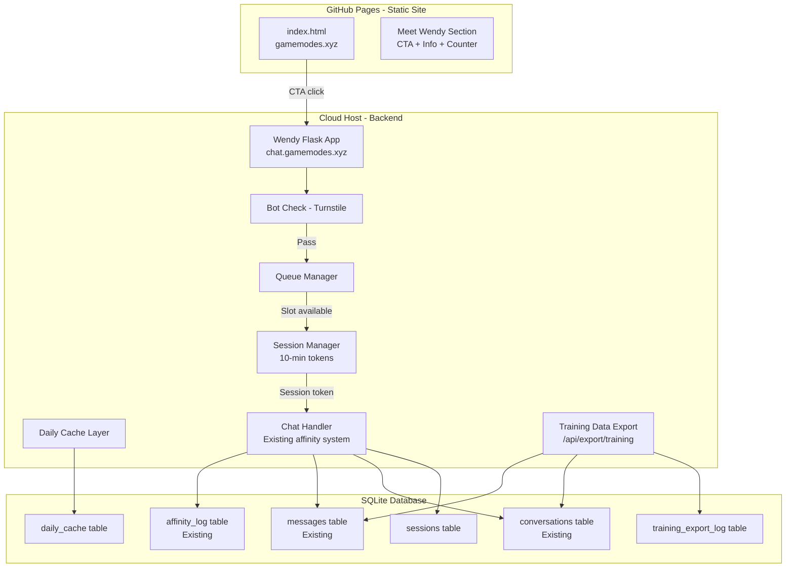
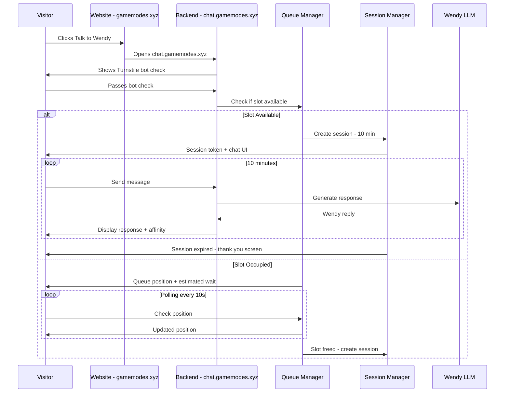

# Wendy Live Demo Integration Plan

## Overview

Integrate Wendy as a live, interactive NPC demonstration on gamemodes.xyz. Visitors who pass a bot check get a 10-minute, one-at-a-time conversation with Wendy. All conversation data is stored and exported as training data for a future fine-tuned Wendy model.

---

## System Architecture



## User Flow



---

## Key Design Decisions

### 1. Backend Hosting

The main site stays on GitHub Pages. The Wendy Flask app is hosted separately.

**Chosen: Railway.app**
- Supports Python/Flask natively
- Persistent disk for SQLite database
- Custom domain support — chat.gamemodes.xyz
- Environment variable management for API keys
- Free/low-cost tiers available
- LLM inference via existing Cerebras free tier (already configured in config.json)

**DNS Setup:** Add CNAME record for `chat.gamemodes.xyz` pointing to the hosting provider.

### 2. Bot Protection: Honeypot + Rate Limiting

No Turnstile account available — using simpler approach:

```
Honeypot Strategy:
- Hidden form field that bots fill but humans dont
- If honeypot field has any value -> reject
- IP-based rate limiting: max 3 session attempts per IP per hour
- User-Agent validation to block obvious bot patterns
- Browser fingerprinting for duplicate detection
```

### 3. Queue System — 2 Concurrent Sessions

In-memory tracking with SQLite persistence. Two concurrent sessions to stay within Cerebras free tier:

```
Active Session Logic:
- Two active sessions allowed at a time
- Queue stores waiting visitors with timestamps
- When session expires or user disconnects, next visitor gets access
- Polling endpoint /api/queue/status returns position + estimated wait
- Max queue size: 20 visitors
- Queue timeout: remove after 5 min of no polling
```

### 4. 10-Minute Session Timer

- Session token issued with `expires_at` timestamp
- Backend enforces expiration on every API call
- Frontend shows countdown timer
- At expiry: conversation ends gracefully, Wendy says goodbye
- 30-second warning before expiry

### 5. Daily Consistency Cache

Wendy should be consistent about herself day-to-day:

**Layer 1 - Fixed Facts - Already in system prompt:**
- Name, age, background, speech patterns - already in [`config.json`](../Wendy/config.json:96)
- These never change and are always consistent

**Layer 2 - Daily Briefing - NEW:**
- On first request each day, generate a daily context block:
  - Todays weather in the holler
  - What Wendy is doing today - helping at the stand, fixing fence, etc.
  - Her mood today
  - One specific thing that happened recently
- Store in `daily_cache` table with date stamp
- Inject into system prompt alongside existing stage behavior
- All visitors that day see consistent day-specific details

**Layer 3 - Response Cache:**
- Cache Wendy's responses to common self-referential questions
- Questions like How old are you, Where do you live, Tell me about your family
- First response of the day is cached, reused for all subsequent visitors
- Resets daily at midnight

### 6. Training Data Export Pipeline — AES-256 Encrypted

**New endpoint:** `GET /api/export/training` (admin-only, bearer token)

All training data exports are AES-256-GCM encrypted. The IFS-based integration methodology is proprietary and must never be exposed in plaintext exports.

```
Encryption Details:
- Algorithm: AES-256-GCM via Python cryptography library
- Key: Stored in TRAINING_ENCRYPTION_KEY environment variable (base64-encoded 32-byte key)
- Export format: Encrypted binary .enc files
- Processing: Conversations read from DB -> formatted -> encrypted in memory -> written as .enc
- NEVER write plaintext training data to disk
- Separate decryption script requires the key to unpack
```

```
Internal Export Format - Alpaca (encrypted before writing):
{
  instruction: You are Wendy, a 22-year-old Appalachian woman...
  input: <user message>,
  output: <wendy response>,
  context: {
    affinity_stage: Friendly,
    affinity_value: 35,
    conversation_position: 5
  }
}
```

**Quality filtering:**
- Only export conversations that reached Acquaintance+ stage
- Filter out conversations flagged as toxic/abusive
- Tag examples by affinity stage for balanced training sets
- Track exports in `training_export_log` to avoid duplicates

### 7. Help Wendy Grow - Marketing Feature

- Live counter on the website showing total conversations had
- Total messages exchanged
- After session: Thank you for helping Wendy grow message
- Visual growth meter or progress bar
- Copy: Every conversation helps train a smarter, more authentic Wendy

---

## Database Schema Changes

### New Tables

```sql
-- Sessions for public demo access
CREATE TABLE IF NOT EXISTS sessions (
    id              INTEGER PRIMARY KEY AUTOINCREMENT,
    session_token   TEXT    NOT NULL UNIQUE,
    ip_hash         TEXT    NOT NULL,
    turnstile_token TEXT,
    conversation_id INTEGER,
    started_at      TEXT    NOT NULL DEFAULT datetime now,
    expires_at      TEXT    NOT NULL,
    ended_at        TEXT,
    is_active       INTEGER NOT NULL DEFAULT 1,
    queue_position  INTEGER,
    source          TEXT    NOT NULL DEFAULT website,
    FOREIGN KEY conversation_id REFERENCES conversations id
);

CREATE INDEX IF NOT EXISTS idx_sessions_token ON sessions session_token;
CREATE INDEX IF NOT EXISTS idx_sessions_active ON sessions is_active;

-- Daily consistency cache
CREATE TABLE IF NOT EXISTS daily_cache (
    id              INTEGER PRIMARY KEY AUTOINCREMENT,
    cache_date      TEXT    NOT NULL,
    cache_type      TEXT    NOT NULL CHECK cache_type IN daily_briefing, response_cache,
    question_hash   TEXT,
    question_text   TEXT,
    response_text   TEXT    NOT NULL,
    created_at      TEXT    NOT NULL DEFAULT datetime now,
    UNIQUE cache_date, cache_type, question_hash
);

CREATE INDEX IF NOT EXISTS idx_daily_cache_date ON daily_cache cache_date;

-- Training data export log
CREATE TABLE IF NOT EXISTS training_export_log (
    id              INTEGER PRIMARY KEY AUTOINCREMENT,
    export_date     TEXT    NOT NULL,
    format          TEXT    NOT NULL DEFAULT alpaca,
    count           INTEGER NOT NULL,
    min_stage       TEXT    NOT NULL DEFAULT Acquaintance,
    filename        TEXT,
    created_at      TEXT    NOT NULL DEFAULT datetime now
);

-- Public stats counter
CREATE TABLE IF NOT EXISTS public_stats (
    key             TEXT    PRIMARY KEY,
    value           INTEGER NOT NULL DEFAULT 0,
    updated_at      TEXT    NOT NULL DEFAULT datetime now
);
```

---

## File-Level Implementation Plan

### Backend Changes - Wendy Flask App

#### 1. New file: `Wendy/session_manager.py`
- `create_session` - issue session token with 10-min expiry
- `validate_session` - check token is active and not expired
- `end_session` - gracefully close session
- `get_active_session` - check if someone is currently chatting
- `get_queue_position` - return position in wait queue
- `join_queue` - add visitor to queue
- `leave_queue` - remove from queue

#### 2. New file: `Wendy/queue_manager.py`
- In-memory queue using Python deque or list
- FIFO ordering
- Auto-promote next person when slot frees
- Max queue size limit - e.g., 20 people
- Queue timeout - remove after 5 min of no polling

#### 3. New file: `Wendy/bot_check.py`
- `verify_turnstile` - server-side Turnstile token verification
- `verify_honeypot` - fallback honeypot check
- Rate limiting helper by IP hash

#### 4. New file: `Wendy/daily_cache.py`
- `get_daily_briefing` - fetch or generate daily context
- `get_cached_response` - check for cached self-referential response
- `cache_response` - store a response in cache
- `is_self_referential` - detect if question is about Wendy herself
- `clear_expired_cache` - cleanup old entries

#### 5. New file: `Wendy/training_export.py`
- `export_conversations` - query and format conversations for training
- `format_alpaca` - convert to Alpaca format
- `filter_by_quality` - apply quality filters
- `get_export_stats` - count exportable conversations by stage

#### 6. Modify: `Wendy/app.py`
- Add new routes:
  - `POST /api/demo/start` - bot check + join queue/get session
  - `GET /api/demo/status` - check queue position or session status
  - `POST /api/demo/chat` - session-aware chat handler
  - `GET /api/demo/stats` - public conversation/message counts
  - `GET /api/export/training` - admin-only training data export
- Modify existing `/api/chat` to check session validity for demo mode
- Add CORS headers for cross-origin requests from gamemodes.xyz

#### 7. Modify: `Wendy/wendy.py`
- Update `build_system_prompt` to inject daily briefing from cache
- Add daily briefing assembly logic

#### 8. Modify: `Wendy/database.py`
- Add new tables to `init_db`
- Add CRUD functions for sessions, daily_cache, training_export_log, public_stats
- Add `increment_stat` function for counters

#### 9. Modify: `Wendy/config.json`
- Add new config sections:
  - `demo` section: session_duration, max_queue_size, queue_timeout
  - `turnstile` section: site_key, secret_key
  - `hosting` section: allowed_origins for CORS
  - `daily_cache` section: enabled, generation_model

### Frontend Changes - Main Website

#### 10. Modify: `index.html`
- Add Meet Wendy section with:
  - Character description and Appalachian theme
  - Live conversation counter stat
  - Help Wendy Grow messaging
  - Talk to Wendy CTA button linking to chat.gamemodes.xyz
- Add Wendy section to nav links
- Update stats bar to include Wendy demo stats
- Add meta tags for Wendy demo

### Frontend Changes - Wendy Chat UI

#### 11. Modify: `Wendy/templates/index.html`
- Add Turnstile widget to new-conversation flow
- Add queue waiting screen with position display
- Add session countdown timer in header
- Add session-expired screen with growth contribution message
- Add visual indicators for demo mode vs local mode
- Hide sidebar conversation list for demo visitors - single conversation only

#### 12. Modify: `Wendy/static/script.js`
- Add queue polling logic
- Add session timer countdown
- Add Turnstile callback handling
- Add session expiry handling
- Add demo mode state management
- Add growth contribution feedback on session end

#### 13. Modify: `Wendy/static/style.css`
- Style queue waiting screen
- Style session timer
- Style demo mode indicator
- Style growth/contribution feedback
- Style Turnstile integration

### Configuration and Deployment

#### 14. New file: `Wendy/requirements.txt` - Update
- Add `flask-cors` for CORS support
- Add `cryptography` for AES-256-GCM training data encryption
- Add `bcrypt` for IP hashing

#### 15. New file: `Wendy/.env.example`
- Template for environment variables
- CEREBRAS_API_KEY
- SESSION_SECRET
- ADMIN_TOKEN for training export
- TRAINING_ENCRYPTION_KEY (base64-encoded 32-byte AES key)

#### 16. Documentation Updates
- Update `DEVLOG.md` with Wendy live demo milestone
- Update `Wendy/README.md` with demo deployment instructions
- Create deployment guide for the cloud hosting setup

---

## Configuration Addition for config.json

```json
{
    "demo": {
        "enabled": true,
        "session_duration_minutes": 10,
        "max_concurrent_sessions": 2,
        "max_queue_size": 20,
        "queue_timeout_minutes": 5,
        "warning_seconds_before_expiry": 30,
        "source": "website"
    },
    "bot_protection": {
        "method": "honeypot",
        "max_session_attempts_per_ip_per_hour": 3,
        "blocked_user_agents": ["python-requests", "curl", "wget", "bot", "crawler"]
    },
    "cors": {
        "allowed_origins": ["https://gamemodes.xyz", "https://www.gamemodes.xyz"]
    },
    "daily_cache": {
        "enabled": true,
        "generation_hour_utc": 0,
        "cache_self_references": true
    },
    "training_export": {
        "encryption_algorithm": "AES-256-GCM",
        "min_stage_for_export": "Acquaintance",
        "export_format": "alpaca"
    }
}
```

---

## Implementation Order

### Phase 1 - Backend Core
1. Add new database tables and functions to `database.py`
2. Create `session_manager.py` with token issuance and validation
3. Create `queue_manager.py` with FIFO queue logic
4. Create `bot_check.py` with honeypot + rate limiting verification
5. Create `daily_cache.py` with caching layer
6. Add demo routes to `app.py`
7. Modify `wendy.py` to inject daily briefing

### Phase 2 - Frontend Demo UI
8. Update `templates/index.html` with queue, timer, and demo screens
9. Update `static/script.js` with demo flow logic
10. Update `static/style.css` with new component styles

### Phase 3 - Website Integration
11. Add Meet Wendy section to main `index.html`
12. Update nav links and stats

### Phase 4 - Training Pipeline
13. Create `training_export.py`
14. Add export endpoint and admin controls

### Phase 5 - Deployment
15. Set up cloud hosting for the Wendy backend
16. Configure DNS for chat.gamemodes.xyz
17. Set environment variables
18. Test end-to-end flow

---

## Security Considerations

- **API keys**: Never expose in frontend; all LLM calls happen server-side
- **IP hashing**: Store hashed IPs only, not raw IPs
- **Rate limiting**: Per-IP rate limiting on all demo endpoints (max 3 session attempts per IP per hour)
- **Input validation**: Existing 2000-char limit enforced, plus sanitize all inputs
- **Session tokens**: Cryptographically random, single-use, time-bounded
- **CORS**: Strict origin allowlist, no wildcard
- **Admin endpoints**: Bearer token authentication for training data export
- **Content moderation**: Light-touch filtering — block only extreme abuse/hate speech. Allow users to explore the full range of Wendy's personality including negative affinity interactions so the training data captures diverse conversation patterns
- **Training data encryption**: AES-256-GCM encryption on all exported training data. Proprietary IFS-based methodology must never be exposed in plaintext. Key stored in environment variable only

---

## Decisions Summary

| Decision | Choice | Rationale |
|----------|--------|-----------|
| Hosting | Railway.app | Python/Flask native, persistent disk, env vars, free tier |
| LLM provider | Cerebras (existing) | Already configured, free tier |
| Bot protection | Honeypot + IP rate limiting | No Turnstile account; simpler to implement |
| Concurrent sessions | 2 max | Stays within Cerebras free tier limits |
| Training data | AES-256-GCM encrypted | Protects proprietary IFS-based methodology |
| Admin auth | Bearer token | Simple, effective for single-admin use |
| Content moderation | Light-touch only | Users need to test full personality range; captures diverse training data |
